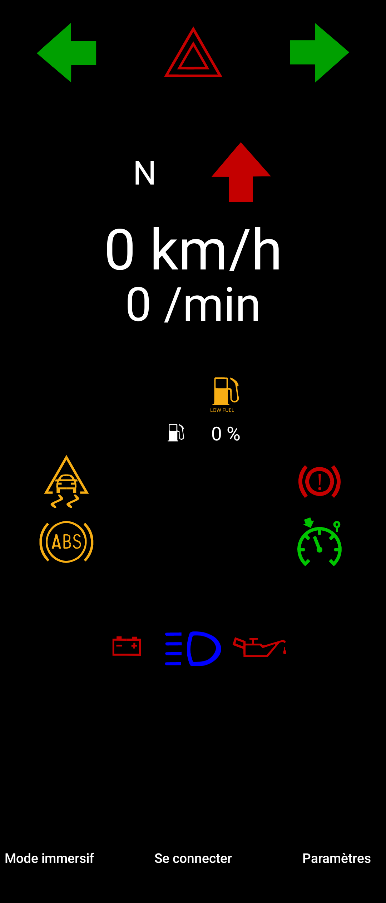
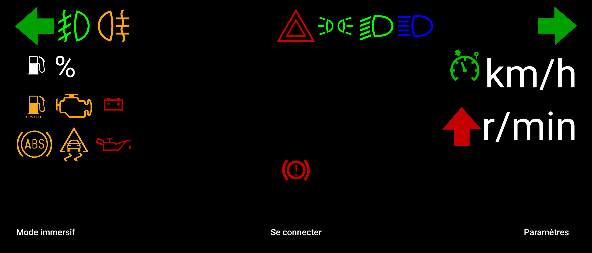

# SmartDash
SmartDash is an application that enables an user to display OutGauge Live for Speed information directly on an Android smartphone.

It comes with a Server running in Java and an application for the smartphone.

## Requirements
- Java (JVM) 11
- An Android device running Android 7.0 Nougat

## Running SmartDash

### On your computer:

- Modify OutGauge values in your _cfg.txt_ from your Live for Speed folder as following:

`OutGauge Mode 1
OutGauge IP 127.0.0.1
OutGauge Port 30001`

- Running the Server on Windows: 'Win+R -> cmd.exe -> Enter -> Navigate to where you downloaded SmartDash -> java -jar 'Server.jar'

- Running the Server on GNU/Linux: well, you should know how to do it :) `java -jar Server.jar`

- Select the Live for Speed port (in this example: 30001 because we put 'OutGauge Port 30001' before)

- Select a port where data will be sent (e.g. 30002)

- Select an IP address to send data (e.g. 192.168.0.255)

- Run Live for Speed

### On your Android device:

- Install the apk

- In 'Settings': select the same port and the same IP - 'Save'

- Go back and click 'Connect'

- Go for a drive and enjoy ! :)

## Screenshots

### Credits
Live for Speed is a game developped by Scawen Roberts, Eric Bailey and Victor van Vlaardingen.

For more information about the game, please visit the [Live for Speed website](https://www.lfs.net/)

Pit Limiter icon by Nominal Two-Two [source](https://commons.wikimedia.org/wiki/File:Cruise_Control.svg) under the [license](https://creativecommons.org/licenses/by-sa/4.0/deed.en)
