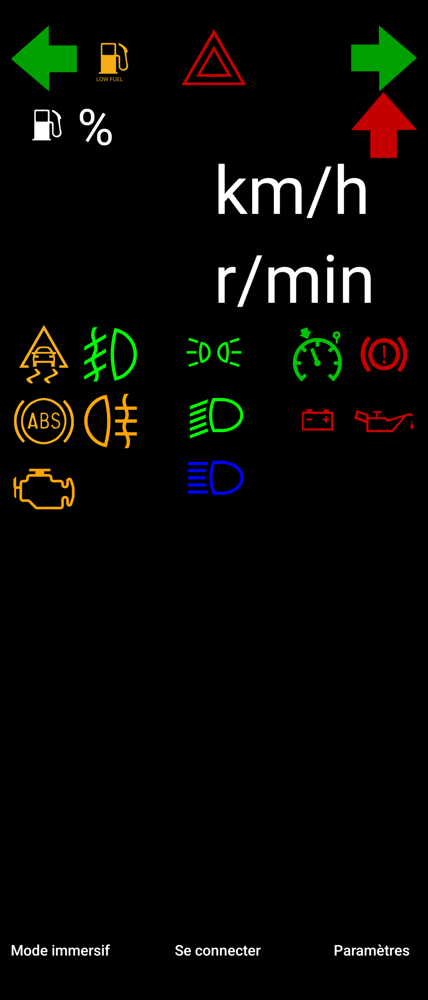

# SmartDash
SmartDash is an application that enables an user to display OutGauge Live for Speed information directly on an Android smartphone.

It comes with a Server running in Java and an application for the smartphone.

## Running SmartDash
Make sure to set up correctly Live for Speed OutGauge Cf. (_cfg.txt_) in order to send the UDP packets.

First you need to run the Server **before** running LFS and then you can connect your smartphone according that you enter the right IP and port settings in the app.

## Roadmap / TODO

- Automaticly set up `cfg.txt` in Live for Speed configuration within `Server.java`

## Screenshots

### Credits
Live for Speed is a game developped by Scawen Roberts, Eric Bailey and Victor van Vlaardingen.

For more information about the game, please visit the [Live for Speed website](https://www.lfs.net/)

Pit Limiter icon by Nominal Two-Two [source](https://commons.wikimedia.org/wiki/File:Cruise_Control.svg) under the [license](https://creativecommons.org/licenses/by-sa/4.0/deed.en)
